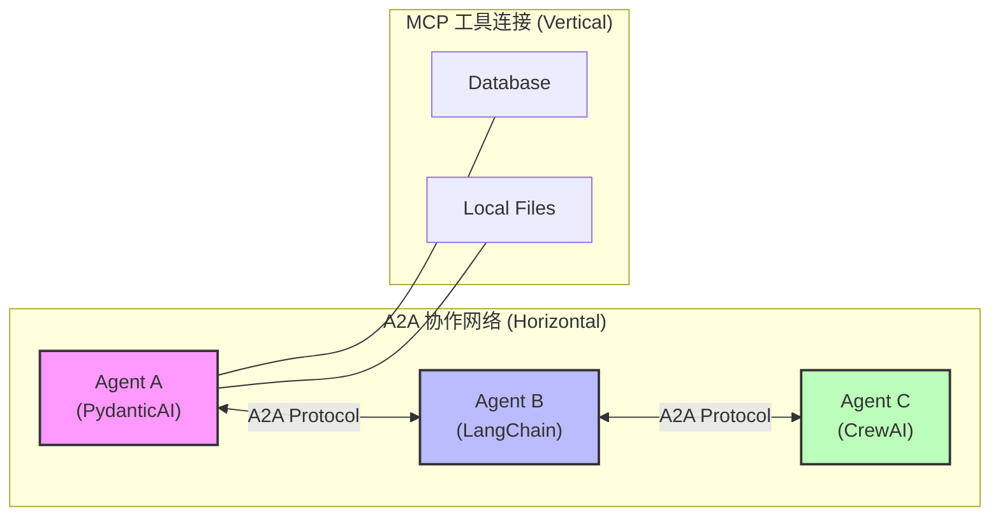
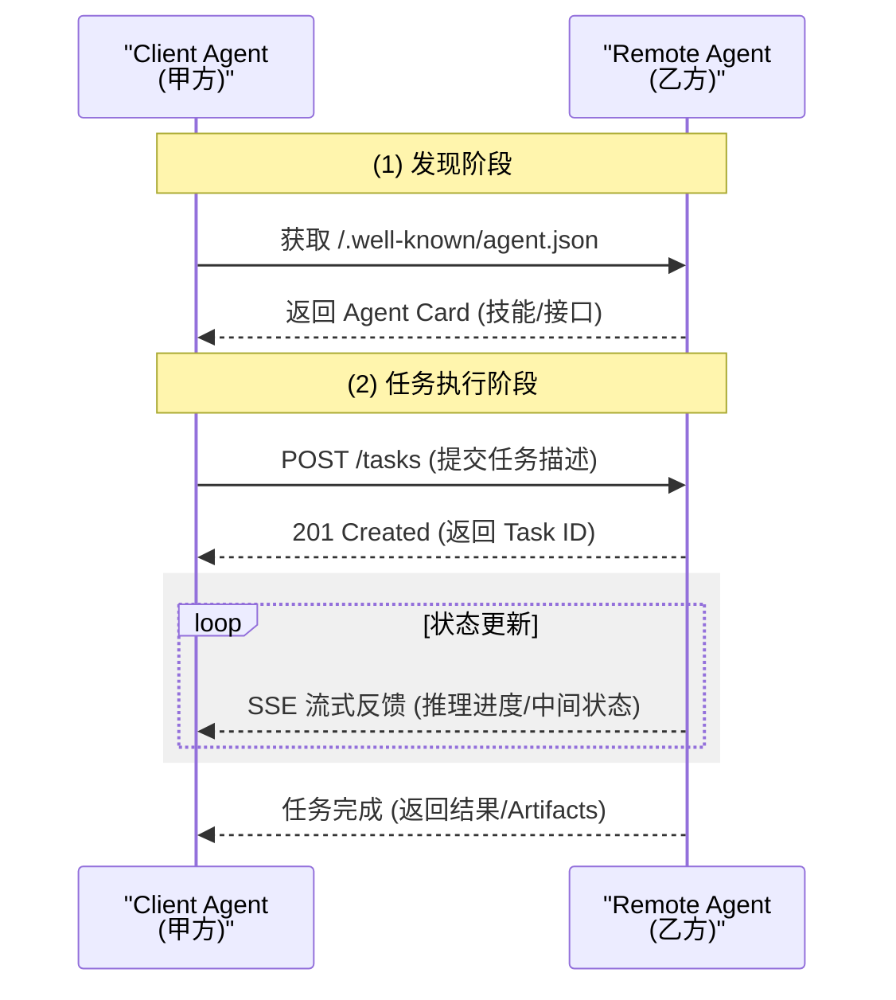
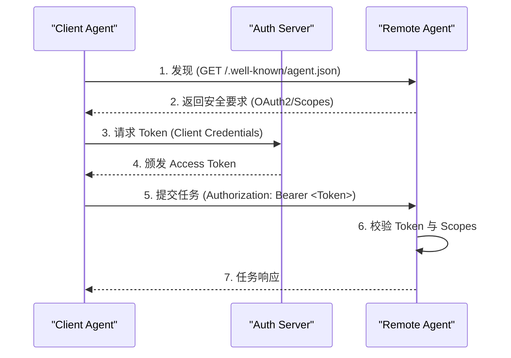
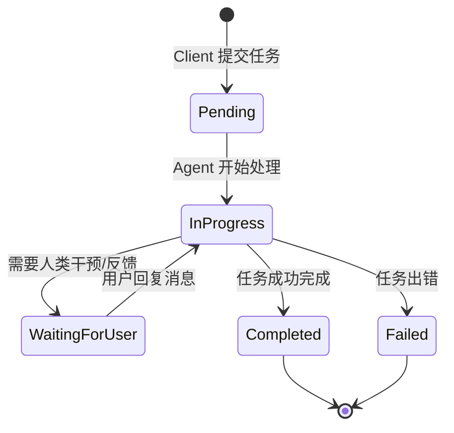
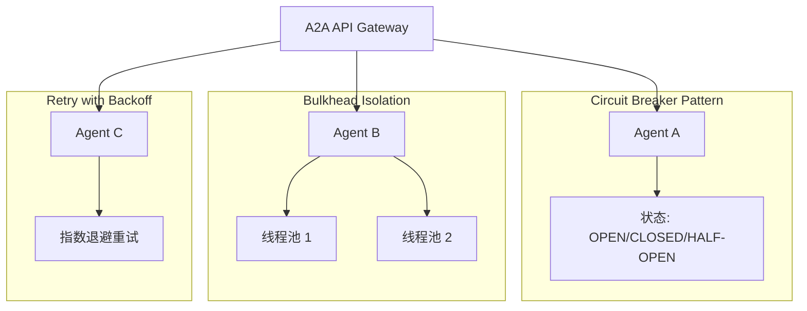
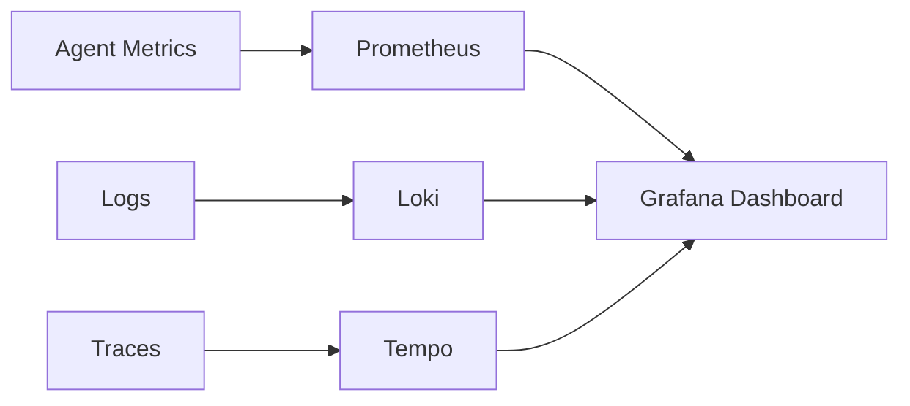
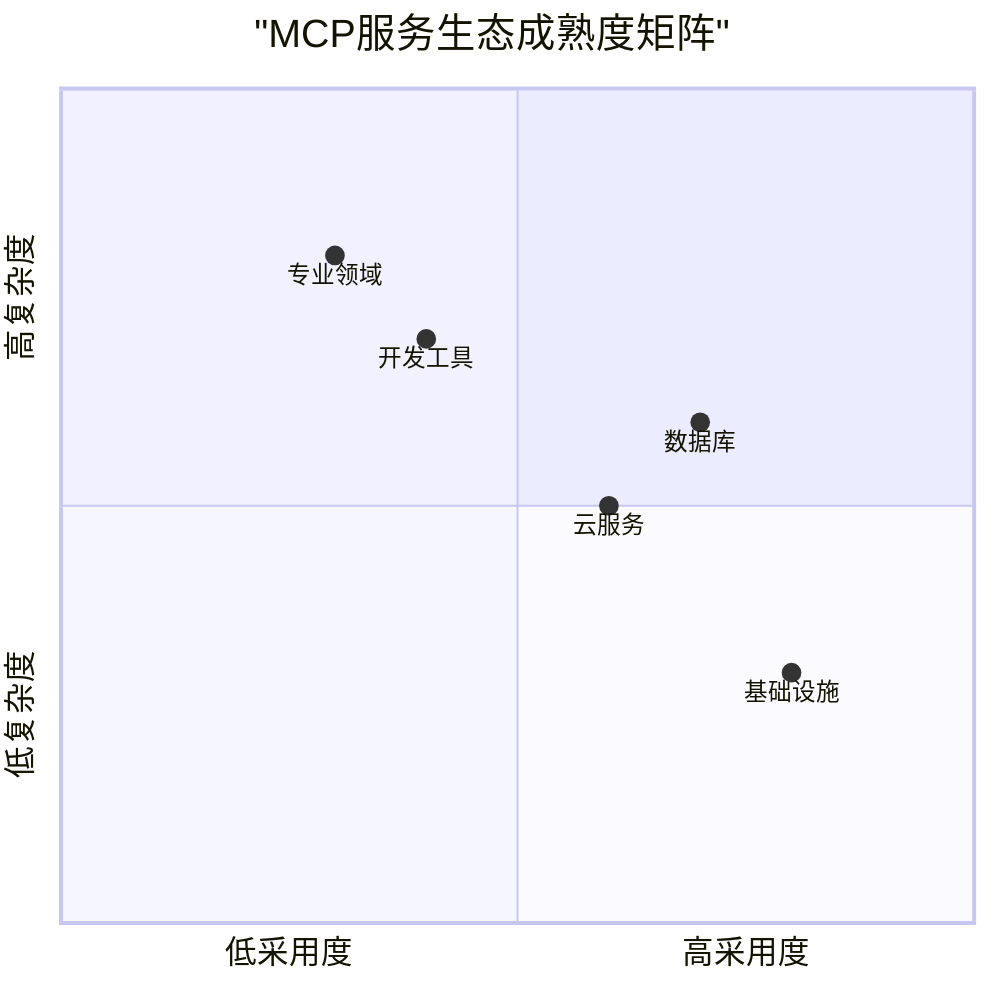
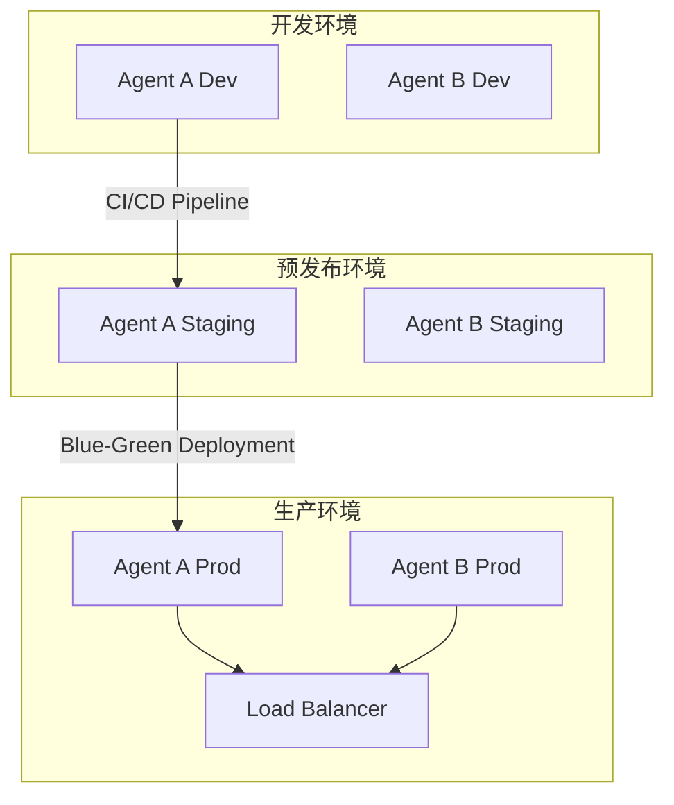
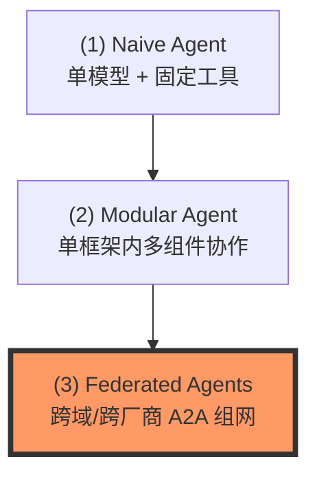
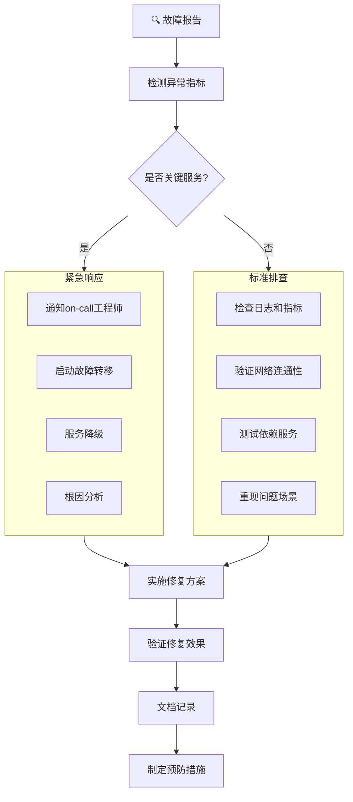

# AI Agent 协作新标准：Google A2A (Agent-to-Agent) 协议深度解析

> **可视化文档优化说明**：
> - **结构重组**：引入了标准设计文档流（背景、模式、对比、演进、实战）。
> - **图表增强**：
>   - **(1) 宏观架构图**：对比 MCP 与 A2A 的连接维度。
>   - **(2) 协作时序图**：展示 Client 与 Remote Agent 的交互生命周期。
> - **(3) 安全交互图**：展示基于 OAuth2/API Key 的身份验证流程。
> - **(4) 任务状态机图**：定义 Agent 在长周期任务中的状态流转。
> - **(5) 演进路线图**：直观呈现 Agent 系统的发展阶段。

---

## 1. 核心定位：什么是 A2A？

**A2A (Agent-to-Agent)** 是 Google 推出的一种开放协议（现已捐赠给 Linux 基金会），旨在解决**跨厂商、跨框架**的智能体互操作性问题。



### 核心愿景
让基于不同框架构建的 Agent，能够通过一套通用的“外交语言”进行对话、协作和任务委派。

---

## 2. 关键设计模式 (Key Patterns)

A2A 不仅仅是一个通信接口，它引入了几个改变开发思维的模式：

### A. 发现模式：Agent Card (身份名片)
每个 A2A Agent 都会在 `/.well-known/agent.json` 路径下提供一份结构化描述。
- **作用**：让其他 Agent 自动发现其“技能（Skills）”、“输入要求（Inputs）”和“认证方式”。
- **工程价值**：实现系统解耦，无需硬编码下游 API。

### B. 协作模式：任务驱动 (Task-Based)
A2A 将所有交流视为一个“任务（Task）”。



### C. 协作编排：层级化 vs 对等化 (Orchestration Styles)
在 A2A 网络中，Agent 间的关系不再是简单的父子调用，而是存在两种典型的协作模式：

1.  **层级化 (Hierarchical)**：由一个“主控 Agent (Supervisor)”负责分解任务，分派给不同的专家 Agent。
    - **适用场景**：复杂任务、需要强一致性输出。
    - **教练提示**：避免主控 Agent 成为瓶颈（LLM 推理延迟）。
2.  **对等化 (Peer-to-Peer/Choreography)**：Agent 之间根据任务状态，自动将接力棒传给下一个 Agent（Handoffs）。
    - **适用场景**：流程化任务、高并发响应。
    - **教练提示**：需要严格的“状态终止”检查，防止任务在 Agent 之间无限漂移。

### D. 上下文治理：摘要传递 (Context Summary)
跨 Agent 协作最忌讳“全量上下文传递”，这会导致 Token 爆炸和注意力分散。
- **模式建议**：发送方 Agent 在委派任务前，应先生成一份 **“任务简报 (Task Brief)”**，仅包含下游 Agent 执行所需的最简上下文。
- **追溯机制**：若下游 Agent 需要更多细节，应通过 A2A 的 `GET /tasks/{id}/artifacts` 接口按需拉取。

---

## 3. 安全架构 (Security Framework)

A2A 协议通过标准化的安全契约，在 Agent 之间建立“信任链”。

### A. AuthN (身份验证) 与 AuthZ (授权)
所有的安全要求都在 **Agent Card** 的 `securitySchemes` 中声明。支持 API Key、OAuth2 和 OpenID Connect。



### B. 信任增强
- **JWS 签名**：Agent Card 可选支持数字签名，防止名片内容在传输中被篡改。
- **不透明授权**：若未授权，服务端统一返回 `404` 而非 `403`，防止任务枚举漏洞。
- **零信任架构**：每次调用都重新验证身份和权限，不依赖会话状态。

### C. 数据安全与隐私保护
- **敏感数据过滤**：在 Agent 间传递数据时自动移除 PII（个人身份信息）和敏感数据
- **数据脱敏策略**：对敏感字段进行掩码处理（如：信用卡号显示为 `****-****-****-1234`）
- **审计日志标准化**：所有 A2A 调用必须记录标准化审计日志，包含：
  - 调用方身份
  - 请求时间戳和唯一ID
  - 操作类型和资源
  - 安全上下文和权限范围

---

## 4. 状态管理模式 (State Management)

A2A 遵循 **“无状态接口，有状态实现”** 的原则，确保分布式环境下的健壮性。

### A. 任务状态机 (Task State Machine)
协议显式定义了任务的生命周期，支持异步长周期执行。



### B. 三层状态解耦
1.  **协议状态 (Protocol State)**：通过 `taskId` 暴露的进度，外部可见。
2.  **短期记忆 (Session Memory)**：任务执行过程中的推理链，内部私有。
3.  **长期记忆 (Profile Memory)**：用户偏好与历史，属于 Agent 的核心资产。

> **架构原则**：禁止 Agent 间共享数据库状态，必须通过 A2A 接口进行“状态查询”或“上下文传递”。

---

## 5. 安全与治理 (Safety & Governance)

在多智能体网络中，不受控的协作会导致系统性风险。A2A 实践中必须包含以下治理措施：

### A. 防范“循环调用” (Infinite Loops)
- **风险**：Agent A 调用 Agent B，B 又调用 A，或者 A -> B -> C -> A，导致 Token 和成本瞬间耗尽。
- **对策**：
    - **Hop Limit (跳数限制)**：在 A2A 任务元数据中携带 `max_hops` 字段，每经过一个 Agent 减 1。
    - **Trace ID (追踪 ID)**：所有关联任务必须携带全局唯一的 `traceId`，Agent 拒绝处理已在路径中的自身调用。

### B. 成本熔断 (Cost Control)
- **风险**：远程 Agent 可能会执行极其昂贵的长链推理。
- **对策**：
    - **Budget Cap (预算上限)**：在 `POST /tasks` 时可选传递 `max_spend`（如以 USD 或 Token 计）。
    - **Dry Run (预估)**：在正式提交前，通过 A2A 扩展接口获取预估成本。

### C. 版本兼容性 (Versioning)
- **策略**：Agent Card 应包含 `version` 字段，遵循语义化版本规范（SemVer）。
- **优雅降级**：当 Client Agent 发现 Remote Agent 升级了接口但自己未适配时，应回退到"基本任务模式"或通过 SSE 告知人类需要干预。
- **多版本并行**：支持同时暴露多个版本的接口（如 `/v1/tasks`, `/v2/tasks`），给予调用方迁移窗口期。

### D. 弹性设计模式 (Resilience Patterns)
在分布式 Agent 网络中，必须内置以下设计模式来防止级联故障：



1. **断路器模式 (Circuit Breaker)**：
   - 当某个 Agent 连续失败时，自动切换到 OPEN 状态，直接返回失败而不发起真实调用
   - 定期进入 HALF-OPEN 状态试探性恢复
   
2. **舱壁隔离模式 (Bulkhead)**：
   - 为不同的 Agent 调用分配独立的资源池（线程池、连接池）
   - 防止一个故障 Agent 耗尽所有系统资源

3. **重试与退避策略**：
   - 实现指数退避重试机制：`base_delay * (2 ^ attempt)`
   - 设置最大重试次数和超时时间

---

## 6. 分布式观测与弹性 (Observability & Resilience)

在 A2A 环境下，调试一个涉及 3 个厂商、5 个 Agent 的任务是极具挑战的。

### A. 全链路追踪 (Distributed Tracing)
- **标准建议**：强制要求在所有 A2A 请求头中携带 `X-Agent-Trace-ID`。
- **Span 记录**：每个 Agent 在处理任务时，应记录其内部推理步骤（Thoughts）作为子 Span，并关联到主任务 ID。
- **教练提示**：这不仅是为了 Debug，更是为了后期的“归因分析”——当结果出错时，到底是谁的推理出了偏差？

### B. 错误处理与补偿机制 (Error Handling)
- **非对称失败**：Remote Agent 可能在任务中途挂掉。
- **模式建议**：
    - **Exponential Backoff**：Client Agent 对状态查询接口实施指数退避重试。
    - **Compensation (补偿)**：若任务失败，Client 应调用 `DELETE /tasks/{id}` 触发清理逻辑（如回滚已生成的临时文件）。
    - **Human Fallback**：当 A2A 协作多次尝试失败时，必须能够通过 SSE 推送一个"人工介入"请求，让用户接管上下文。

### C. 性能监控与 SLA 指标 (Performance Monitoring)
在生产环境中，必须建立完善的性能监控体系：



#### 关键性能指标 (KPIs)
1.  **延迟指标**：
    - `a2a_task_duration_seconds` - 任务执行时间
    - `a2a_request_latency_ms` - 请求响应延迟
    - 分位数统计：P50, P90, P95, P99

2.  **吞吐量指标**：
    - `a2a_requests_total` - 总请求数
    - `a2a_tasks_processed_total` - 处理任务数
    - `a2a_concurrent_connections` - 并发连接数

3.  **错误率指标**：
    - `a2a_errors_total` - 错误总数
    - `a2a_error_rate` - 错误率百分比
    - 按错误类型分类：timeout, auth, validation

4.  **资源使用指标**：
    - `a2a_memory_usage_bytes` - 内存使用量
    - `a2a_cpu_usage_percent` - CPU使用率
    - `a2a_network_io_bytes` - 网络IO

#### SLA 等级协议示例
```yaml
service_level_objectives:
  availability: 99.9%  # 每月宕机时间不超过43分钟
  latency:
    p99: 2000ms        # 99%请求在2秒内完成
    p95: 1000ms        # 95%请求在1秒内完成
  throughput:
    max_rps: 1000      # 最大每秒1000请求
    max_concurrent: 100 # 最大100并发连接
  error_budget:
    max_error_rate: 0.1%  # 错误率不超过0.1%
    retry_policy: max_3_retries_with_exponential_backoff
```

#### 监控最佳实践
- **四大黄金信号**：延迟、流量、错误、饱和度
- **自动化告警**：基于SLO的错误预算消耗告警
- **容量规划**：基于历史数据的资源预测和扩容

---

## 7. 测试策略：如何确保你的 Agent "好相处"？

在将 Agent 接入 A2A 网络前，你需要进行以下测试：

1.  **Card 校验**：使用 A2A Schema 验证你的 `agent.json` 是否合规。
2.  **Mock 协同测试**：编写一个 Mock Client Agent，模拟各种极端情况（如：超时、SSE 中断、返回乱码）来测试你的 Agent 的鲁棒性。
3.  **多轮交互压力测试**：模拟长序列对话，观察 Agent 是否会出现上下文漂移或死循环。

### 详细的测试策略

#### A. 单元测试 (Unit Testing)
```python
# 测试 Agent Card 验证
@pytest.mark.parametrize("card_data, expected", [
    (valid_card, True),
    (card_missing_version, False),
    (card_invalid_security_scheme, False),
])
def test_agent_card_validation(card_data, expected):
    validator = AgentCardValidator()
    assert validator.validate(card_data) == expected

# 测试任务状态机转换
@pytest.mark.parametrize("current_state, action, expected_state", [
    ("pending", "start_processing", "in_progress"),
    ("in_progress", "complete", "completed"),
    ("in_progress", "fail", "failed"),
    ("waiting_for_user", "user_response", "in_progress"),
])
def test_task_state_transitions(current_state, action, expected_state):
    task = Task(state=current_state)
    task.process_action(action)
    assert task.state == expected_state
```

#### B. 集成测试 (Integration Testing)

```python
# 使用 pytest-asyncio 进行异步集成测试
@pytest.mark.asyncio
async def test_a2a_task_lifecycle():
    """测试完整的A2A任务生命周期"""
    
    # 1. 创建测试客户端
    async with AsyncClient(app=app, base_url="http://test") as client:
        
        # 2. 提交新任务
        response = await client.post("/tasks", json={
            "input": {"research_topic": "AI trends 2024"},
            "parameters": {"depth": "detailed"}
        })
        assert response.status_code == 201
        task_id = response.json()["taskId"]
        
        # 3. 查询任务状态
        status_response = await client.get(f"/tasks/{task_id}")
        assert status_response.status_code == 200
        assert status_response.json()["status"] == "in_progress"
        
        # 4. 模拟SSE流式更新
        async with client.stream("GET", f"/tasks/{task_id}/stream") as response:
            events = []
            async for line in response.aiter_lines():
                if line.startswith('data:'):
                    event_data = json.loads(line[5:])
                    events.append(event_data)
                    if event_data.get("status") == "completed":
                        break
        
        # 5. 验证任务结果
        assert len(events) > 0
        assert events[-1]["status"] == "completed"
```

#### C. 混沌工程测试 (Chaos Engineering)

```python
# 使用 chaos-mesh 或自定义混沌测试
@pytest.mark.chaos
def test_network_partition_resilience():
    """测试网络分区下的弹性能力"""
    
    # 1. 模拟网络延迟
    with network_delay("500ms-2s"):
        response = client.post("/tasks", json=task_payload, timeout=10)
        assert response.status_code == 201
    
    # 2. 模拟服务不可用
    with service_outage("database", duration="30s"):
        # 应该优雅降级或返回适当错误
        response = client.get(f"/tasks/{task_id}")
        assert response.status_code in [200, 503]
    
    # 3. 模拟高负载
    with load_test(1000):  # 1000 RPS
        responses = []
        for _ in range(100):
            response = client.post("/tasks", json=task_payload)
            responses.append(response.status_code)
        
        success_rate = sum(1 for code in responses if code == 201) / len(responses)
        assert success_rate >= 0.95  # 95%成功率
```

#### D. 性能基准测试 (Performance Benchmarking)

```python
# 使用 locust 或 pytest-benchmark 进行性能测试
@pytest.mark.performance
def test_a2a_performance_benchmark():
    """A2A性能基准测试"""
    
    # 1. 延迟测试
    def test_task_creation():
        start_time = time.time()
        response = client.post("/tasks", json=basic_task)
        end_time = time.time()
        
        assert response.status_code == 201
        return end_time - start_time
    
    # 运行多次取平均值
    latencies = [test_task_creation() for _ in range(100)]
    avg_latency = sum(latencies) / len(latencies)
    
    # 性能断言
    assert avg_latency < 1.0  # 平均延迟小于1秒
    assert max(latencies) < 3.0  # 最大延迟小于3秒
    
    # 2. 吞吐量测试
    @pytest.mark.parametrize("concurrent_users", [10, 50, 100])
    def test_throughput(concurrent_users):
        results = []
        with ThreadPoolExecutor(max_workers=concurrent_users) as executor:
            futures = [executor.submit(create_task) for _ in range(concurrent_users)]
            for future in as_completed(futures):
                results.append(future.result())
        
        success_count = sum(1 for result in results if result == 201)
        assert success_count / concurrent_users >= 0.9  # 90%成功率
```

#### E. 安全测试 (Security Testing)

```python
# OWASP ZAP 或自定义安全测试
@pytest.mark.security
def test_a2a_security_vulnerabilities():
    """A2A安全漏洞测试"""
    
    # 1. SQL注入测试
    malicious_input = {
        "research_topic": "AI'; DROP TABLE users; --"
    }
    response = client.post("/tasks", json=malicious_input)
    # 应该返回400而不是500
    assert response.status_code in [400, 422]
    
    # 2. XSS测试
    xss_payload = {
        "input": {"comment": "<script>alert('XSS')</script>"}
    }
    response = client.post("/tasks", json=xss_payload)
    # 应该正确过滤或拒绝
    assert response.status_code in [400, 422]
    
    # 3. 认证绕过测试
    # 尝试未授权访问
    response = client.get("/tasks/sensitive-task-id", headers={})
    assert response.status_code == 401  # 未授权
    
    # 4. 速率限制测试
    for i in range(110):  # 超过限制
        response = client.post("/tasks", json=basic_task)
        if i >= 100:  # 限流阈值
            assert response.status_code == 429  # 太多请求
```

#### F. 兼容性测试 (Compatibility Testing)

```python
# 多版本兼容性测试
@pytest.mark.compatibility
@pytest.mark.parametrize("a2a_version", ["1.0.0", "1.1.0", "2.0.0"])
def test_backward_compatibility(a2a_version):
    """测试向后兼容性"""
    
    # 设置特定版本
    headers = {"X-A2A-Version": a2a_version}
    
    # 测试不同版本的API
    response = client.post("/tasks", json=task_payload, headers=headers)
    
    if a2a_version.startswith("1."):
        # v1.x 应该正常工作
        assert response.status_code == 201
    elif a2a_version == "2.0.0":
        # v2.0 可能有新特性或变更
        assert response.status_code in [201, 400]
```

#### 测试覆盖率要求
```yaml
test_coverage:
  unit_tests: 80%
  integration_tests: 70%
  api_coverage: 95%
  error_paths: 90%
  
  required_tests:
    - authentication
    - authorization
    - input_validation
    - error_handling
    - state_management
    - performance
    - security
```

---

## 8. 代码实战示例 (Code Examples)

### A. Agent Card 完整示例
```json
{
  "version": "1.0.0",
  "name": "Research Analyst Agent",
  "description": "Specializes in market research and analysis",
  "skills": ["market_analysis", "data_synthesis", "report_generation"],
  "endpoints": {
    "tasks": "/tasks",
    "taskStatus": "/tasks/{id}",
    "artifacts": "/tasks/{id}/artifacts",
    "messages": "/tasks/{id}/messages"
  },
  "securitySchemes": {
    "apiKey": {
      "type": "apiKey", 
      "in": "header",
      "name": "X-API-Key"
    },
    "oauth2": {
      "type": "oauth2",
      "flows": {
        "clientCredentials": {
          "tokenUrl": "https://auth.example.com/token",
          "scopes": {
            "tasks:execute": "Execute tasks",
            "tasks:read": "Read task status"
          }
        }
      }
    }
  },
  "inputSchema": {
    "type": "object",
    "properties": {
      "research_topic": {"type": "string"},
      "depth": {"type": "string", "enum": ["overview", "detailed", "comprehensive"]},
      "sources": {"type": "array", "items": {"type": "string"}}
    },
    "required": ["research_topic"]
  }
}
```

### B. SSE 流式响应实现
```python
import asyncio
import json
from sse_starlette.sse import EventSourceResponse

async def task_execution_stream(task_id):
    """SSE 流式任务执行进度"""
    
    # 模拟任务执行步骤
    steps = [
        ("正在分析研究主题...", 25),
        ("收集相关数据源...", 50), 
        ("生成分析报告...", 75),
        ("任务完成", 100)
    ]
    
    for message, progress in steps:
        event_data = {
            "taskId": task_id,
            "status": "in_progress",
            "progress": progress,
            "message": message,
            "timestamp": datetime.now().isoformat()
        }
        
        yield {
            "event": "status_update",
            "data": json.dumps(event_data)
        }
        
        # 模拟处理时间
        await asyncio.sleep(2)
    
    # 最终完成事件
    yield {
        "event": "task_completed",
        "data": json.dumps({
            "taskId": task_id,
            "status": "completed",
            "result": {"report_url": "/reports/123.pdf"}
        })
    }

# FastAPI 路由示例
@app.get("/tasks/{task_id}/stream")
async def stream_task_updates(task_id: str):
    return EventSourceResponse(task_execution_stream(task_id))
```

### C. 错误处理中间件
```python
from fastapi import HTTPException, Request
from fastapi.responses import JSONResponse

@app.exception_handler(A2AError)
async def a2a_error_handler(request: Request, exc: A2AError):
    """统一的 A2A 错误响应格式"""
    
    error_map = {
        "invalid_input": (400, "Invalid input parameters"),
        "rate_limited": (429, "Rate limit exceeded"),
        "task_timeout": (504, "Task execution timeout"),
        "insufficient_scope": (403, "Insufficient permissions")
    }
    
    status_code, message = error_map.get(exc.error_code, (500, "Internal server error"))
    
    return JSONResponse(
        status_code=status_code,
        content={
            "error": {
                "code": exc.error_code,
                "message": message,
                "taskId": exc.task_id,
                "details": exc.details
            }
        }
    )
```

---

## 9. 根本性辨析：A2A vs MCP

| 特性 | **MCP (Model Context Protocol)** | **A2A (Agent-to-Agent)** |
| :--- | :--- | :--- |
| **发起者** | Anthropic | Google |
| **连接方向** | **垂直连接**：Agent ↔️ 工具/数据 | **水平连接**：Agent ↔️ Agent |
| **主要功能** | 标准化 Tool Call、提示词上下文、资源访问 | 标准化 Agent 间的握手、任务派发、状态同步 |
| **形象类比** | Agent 的"万能驱动/USB 接口" | Agent 的"外交礼仪/互联网协议" |
| **知名实例** | **Microsoft MCP**, Playwright MCP, PostgreSQL MCP, AWS MCP | **Google A2A**, 跨厂商Agent协作网络 |

### 决策矩阵：何时作为“工具(MCP)”，何时作为“智能体(A2A)”？

作为教练，我建议你根据以下逻辑进行选型：

- **选 MCP (Tool)**：
    - 任务逻辑单一、确定性强（如：查询 SQL、读取本地文件）。
    - 需要低延迟、频繁交互。
    - 不需要维护复杂的中间状态或进行自主规划。
- **选 A2A (Remote Agent)**：
    - 任务需要多步推理、自主决策（如：写一篇调研报告并多方求证）。
    - 任务执行周期长（分钟级甚至小时级）。
    - 跨越了组织边界或技术栈（如：Python 写的 Agent 调用 JS 写的专家 Agent）。

### MCP 服务生态详解

#### 🏢 企业级MCP服务
- **Microsoft MCP套件**：官方企业级实现，提供完整的MCP协议支持和工具链
- **AWS MCP服务**：Amazon云服务的MCP集成，包括S3、Lambda等资源访问
- **Google Cloud MCP**：GCP服务的标准化连接接口

#### 🗄️ 数据库MCP服务  
- **PostgreSQL MCP**：关系型数据库查询和事务管理
- **MongoDB MCP**：文档数据库的CRUD操作和聚合查询
- **Redis MCP**：缓存和键值存储的快速访问
- **Elasticsearch MCP**：全文搜索和数据分析能力

#### 🌐 云服务MCP集成
- **GitHub MCP**：代码仓库管理、PR审查、CI/CD集成
- **Slack MCP**：团队协作消息发送和频道管理  
- **JIRA MCP**：项目管理和工作流自动化
- **Salesforce MCP**：CRM数据访问和销售流程自动化

#### 🛠️ 开发工具MCP
- **Docker MCP**：容器生命周期管理和镜像构建
- **Kubernetes MCP**：集群部署和服务编排  
- **Terraform MCP**：基础设施即代码的状态管理和部署
- **Jenkins MCP**：持续集成和交付流水线控制

#### 🎯 专业领域MCP
- **Playwright MCP**：浏览器自动化和网页交互测试
- **Stripe MCP**：支付处理和订阅管理
- **Twilio MCP**：短信和语音通信服务
- **OpenAI MCP**：多模型推理和AI服务调用

#### 📊 MCP生态成熟度


---

## 9. 部署与运维指南 (Deployment & Operations)

### A. 容器化部署最佳实践



#### Docker 镜像配置
```dockerfile
# 多阶段构建优化
FROM python:3.11-slim as builder
COPY requirements.txt .
RUN pip install --user -r requirements.txt

FROM python:3.11-slim
COPY --from=builder /root/.local /root/.local
COPY . .

# 安全最佳实践
USER nobody  # 非root用户运行
EXPOSE 8000
HEALTHCHECK --interval=30s --timeout=3s --start-period=5s --retries=3 \
  CMD curl -f http://localhost:8000/health || exit 1

CMD ["uvicorn", "app:app", "--host", "0.0.0.0", "--port", "8000"]
```

#### Kubernetes 部署配置
```yaml
# deployment.yaml
apiVersion: apps/v1
kind: Deployment
metadata:
  name: a2a-agent
spec:
  replicas: 3
  strategy:
    type: RollingUpdate
    rollingUpdate:
      maxSurge: 1
      maxUnavailable: 0
  template:
    spec:
      containers:
      - name: agent
        image: your-registry/a2a-agent:latest
        ports:
        - containerPort: 8000
        resources:
          requests:
            memory: "256Mi"
            cpu: "250m"
          limits:
            memory: "512Mi"
            cpu: "500m"
        livenessProbe:
          httpGet:
            path: /health
            port: 8000
          initialDelaySeconds: 10
          periodSeconds: 30
        readinessProbe:
          httpGet:
            path: /ready
            port: 8000
          initialDelaySeconds: 5
          periodSeconds: 10
```

### B. 环境配置管理

#### 多环境配置
```yaml
# config/production.yaml
server:
  host: 0.0.0.0
  port: 8000
  workers: 4

logging:
  level: INFO
  format: json

monitoring:
  prometheus_port: 9090
  metrics_path: /metrics

security:
  cors_origins:
    - https://your-domain.com
  rate_limiting:
    enabled: true
    requests_per_minute: 1000
```

#### 密钥管理
```bash
# 使用外部密钥管理
export DATABASE_URL=$(vault read -field=value secret/a2a/database)
export API_KEY=$(aws secretsmanager get-secret-value --secret-id a2a-api-key)
```

### C. 运维监控与告警

#### Prometheus 告警规则
```yaml
# alert-rules.yaml
groups:
- name: a2a-agent
  rules:
  - alert: HighErrorRate
    expr: rate(a2a_errors_total[5m]) > 0.05
    for: 5m
    labels:
      severity: critical
    annotations:
      summary: "High error rate detected"
      description: "Error rate is above 5% for the last 5 minutes"

  - alert: HighLatency
    expr: histogram_quantile(0.99, rate(a2a_request_duration_seconds_bucket[5m])) > 2
    for: 10m
    labels:
      severity: warning
    annotations:
      summary: "High latency detected"
      description: "P99 latency is above 2 seconds for the last 10 minutes"
```

#### 容量规划建议
- **内存估算**：基准内存 + (并发数 × 平均上下文大小)
- **CPU估算**：基准CPU + (RPS × 平均处理时间)
- **网络带宽**：平均请求大小 × RPS × 安全系数(2.0)

### D. 灾难恢复策略

#### 备份策略
```yaml
backup:
  schedule: "0 2 * * *"  # 每天凌晨2点
  retention: 30d
  targets:
    - database
    - configuration
    - model_artifacts

recovery:
  rto: 15m  # 恢复时间目标
  rpo: 5m   # 恢复点目标
```

---

## 10. 架构演进：从单体到 A2A 协作



### 演进阶段说明
1.  **Naive Agent**：一个 LLM + 一堆 Tools。
2.  **Modular Agent (单框架)**：如 LangGraph。虽然模块化，但必须在同一生态内。
3.  **A2A Federated Agents**：不同公司开发的 Agent 像微服务一样组网，实现真正的“Agentic Web”。

---

## 10. 开发者实战：如何开始？

要让你的 Agent 符合 A2A，你需要实现以下核心逻辑：

1.  **暴露 Agent Card**：提供 JSON 格式的元数据。
2.  **实现标准接口**：
    - `POST /tasks`：接收新任务。
    - `GET /tasks/{id}`：查询状态。
    - `POST /tasks/{id}/messages`：进行交互（如 Human-in-the-loop）。
3.  **支持流式响应**：利用 Server-Sent Events (SSE) 实时反馈。

---

## 11. 技术栈选型：Pydantic AI vs Google GCP 平台

### 核心诊断：Pydantic AI 的 A2A 哲学

Pydantic AI 不提供类似 AutoGen 或 CrewAI 的开箱即用“黑盒编排器”（如 `GroupChatManager`）。它提倡 **"显式优于隐式"** 的 **Agent Delegation (智能体委托)** 模式。

**两种主要实现路径：**

1.  **进程内委托 (Agent Delegation)**：通过 `Tool` 将子 Agent 挂载到主 Agent，适合强依赖、低延迟的模块化拆分。
2.  **跨进程协作 (HTTP/RPC)**：通过标准网络协议交互，适合异构、分布式的微服务架构。

---

### A. 进程内模式：Agent Delegation (原生支持)

这是 Pydantic AI 最具特色的 A2A 实现方式，将 Agent B 作为工具注入给 Agent A。

#### 1. 代码实战：Router & Coder 模式
```python
from pydantic_ai import Agent, RunContext

# 1. 定义子 Agent (Coder)
coder_agent = Agent(
    'openai:gpt-4-turbo',
    system_prompt='你是一个Python专家，只返回代码。'
)

# 2. 定义主 Agent (Router)
router_agent = Agent(
    'openai:gpt-4-turbo',
    system_prompt='你是一个项目经理。如果是编程任务，请调用 delegate_coding_tool。'
)

# 3. 关键步骤：通过工具连接 (A2A 胶水代码)
@router_agent.tool
async def delegate_coding_tool(ctx: RunContext, task_description: str) -> str:
    """当用户需要写代码时，调用此工具。"""
    # 显式委托：父 Agent 调用 子 Agent
    result = await coder_agent.run(task_description)
    return result.data

# 4. 运行
# await router_agent.run("帮我写一个快速排序算法")
```

#### 2. 架构权衡 (vs AutoGen/CrewAI)

| 特性 | Pydantic AI (显式委托) | AutoGen / CrewAI (框架编排) |
| :--- | :--- | :--- |
| **控制力** | **高**。完全控制数据流、重试和上下文清洗。 | **中/低**。受限于框架内置循环。 |
| **类型安全** | **极高**。接口由 Pydantic 模型严格定义。 | **低**。多为自然语言交互，易产生幻觉。 |
| **适用场景** | **生产级工程**。客服、订单流转等确定性任务。 | **原型验证**。开放式探索、创意头脑风暴。 |

---

### B. 扩展模式：自定义 HTTP 服务 (跨进程)

Pydantic AI 同样提供了强大的基础能力，适合构建需要通过网络交互的独立 Agent 服务。

#### 核心优势：
- **完全控制**：可以精确控制每个Agent的行为和交互逻辑
- **灵活定制**：支持复杂的多Agent编排模式和状态管理
- **成本优化**：按实际使用量付费，避免平台额外费用
- **避免厂商锁定**：代码可移植到其他平台

#### 实现示例：
```python
from pydantic_ai import Agent, RunContext
from pydantic import BaseModel, Field
from typing import List, Optional

# A2A 标准数据结构
class AgentCard(BaseModel):
    name: str = Field(..., description="Agent名称")
    description: str = Field(..., description="Agent功能描述")
    capabilities: List[str] = Field(..., description="支持的能力列表")
    endpoint: str = Field(..., description="服务端点")

class A2ATaskRequest(BaseModel):
    task_id: str = Field(..., description="任务唯一标识")
    description: str = Field(..., description="任务描述")
    context: Optional[dict] = Field(None, description="执行上下文")

# 专业Agent定义
financial_analyst = Agent(
    model="openai:gpt-4o",
    system_prompt="专业财务分析师",
    output_type=A2ATaskResponse
)

# A2A服务实现
class A2AService:
    def __init__(self):
        self.agent_card = AgentCard(
            name="BusinessConsultantAgent",
            description="企业级业务咨询智能体",
            capabilities=["financial_analysis", "legal_review"],
            endpoint="https://api.yourdomain.com/a2a/tasks"
        )
    
    async def handle_task(self, task_request: A2ATaskRequest):
        # 任务路由和处理逻辑
        pass
```

#### 适用场景：
- 需要高度定制化的A2A协议扩展
- 对成本敏感，希望避免平台额外费用
- 需要避免厂商锁定的企业级应用
- 有特殊的安全和合规要求

#### 3. 模式深度对比：进程内委托 vs 跨进程协作

| 核心维度 | 进程内委托 (In-Process Delegation) | 跨进程协作 (Inter-Process HTTP) |
| :--- | :--- | :--- |
| **通信成本** | ⚡️ **极低** (内存函数调用) | 🐢 **较高** (网络序列化/反序列化) |
| **部署架构** | 📦 **单体应用** (Monolith/Modular Monolith) | ☁️ **微服务** (Microservices) |
| **故障隔离** | ⚠️ **低** (一个子 Agent 崩溃可能拖垮整个进程) | 🛡 **高** (服务独立，互不影响) |
| **技术栈限制** | 🔒 **单一** (必须统一用 Python/Pydantic AI) | 🔓 **灵活** (子 Agent 可以是 Node.js/Go 实现) |
| **最佳场景** | **垂直领域深耕** (如：复杂的数据分析流水线) | **水平能力集成** (如：调用企业内部已有的搜索服务) |

### C. Google GCP 平台现成方案

GCP 提供了完整的A2A基础设施，适合快速上线和降低运维复杂度。

#### 核心优势：
- **快速部署**：内置A2A相关服务，减少开发时间
- **运维简单**：GCP负责基础设施维护和监控
- **企业级特性**：内置认证、监控、日志等企业功能
- **生态集成**：与GCP其他服务无缝集成

#### 主要服务：
1. **Vertex AI Agent Builder** - 提供预构建的Agent框架和多Agent协作能力
2. **Cloud Run + Vertex AI** - 灵活组合，自定义Agent部署
3. **Dialogflow CX** - 对话型Agent协作场景
4. **Cloud Endpoints** - 标准的API管理和发现服务

#### 实现示例：
```python
from google.cloud import aiplatform
from google.cloud.aiplatform import vertex_ai

# 使用GCP现成服务创建A2A Agent
def create_gcp_agent(agent_config):
    agent = aiplatform.PreviewAgent(
        project=agent_config.project_id,
        location=agent_config.location,
        display_name=agent_config.name
    )
    return agent

# GCP内置了任务路由、状态管理、监控等复杂功能
class GCPA2AService:
    def __init__(self):
        self.agents = {
            "financial": create_gcp_agent(financial_config),
            "legal": create_gcp_agent(legal_config)
        }
    
    async def handle_task(self, task_request):
        # GCP处理了服务发现、认证、监控等复杂问题
        return await self.agents[task_request.type].process(task_request)
```

#### 适用场景：
- 需要快速上线和验证概念
- 已经在GCP生态系统中
- 不想处理基础设施的复杂性
- 企业级SLA和可靠性是关键需求

### D. 方案对比与选型指南

| 维度 | Pydantic AI自定义实现 | GCP现成方案 |
|------|---------------------|------------|
| **控制度** | 🟢 完全控制 | 🟡 受平台限制 |
| **开发成本** | 🔴 高（需要实现所有A2A协议） | 🟢 低（平台提供基础设施） |
| **维护成本** | 🔴 高（需要自己维护） | 🟢 低（GCP负责运维） |
| **扩展性** | 🟢 极强（可任意定制） | 🟡 中等（受平台功能限制） |
| **集成难度** | 🔴 高（需要处理认证、监控等） | 🟢 低（原生GCP服务集成） |
| **成本结构** | 🟢 按需付费（可能更便宜） | 🟡 平台有额外费用 |
| **上线速度** | 🔴 慢（需要完整开发） | 🟢 快（使用现成服务） |

### E. 混合架构建议

对于大多数企业场景，推荐**混合方案**：

```python
def create_hybrid_a2a_system():
    """混合架构：核心业务用自定义，基础设施用GCP"""
    return {
        "agent_core": "pydantic_ai_custom",  # 业务逻辑自己控制
        "deployment": "gcp_cloud_run",       # 部署用GCP管理
        "monitoring": "gcp_operations",      # 监控用GCP现成
        "auth": "gcp_iap",                   # 认证用GCP IAP
        "discovery": "custom_agent_card",    # 服务发现自己实现
    }
```

**实施策略**：
1. 先用GCP Vertex AI快速原型验证A2A想法
2. 遇到定制需求时，用Pydantic AI补充实现特定功能  
3. 生产环境根据实际性能需求选择完全自定义或GCP托管

---

---

## 12. 未来展望：从 API 到 Agentic Web

A2A 协议的真正潜力在于构建一个 **“智能体万维网” (Agentic Web)**。

- **动态发现与按需组网**：Agent 不再需要预先配置，而是根据任务需求，在网络中搜索最合适的专家 Agent 并实时建立连接。
- **价值交换模型**：结合 A2A 的安全框架，未来可能出现基于微支付的 Agent 协作市场，每个任务委派都伴随着价值转移。

---

## 13. 故障排查与运维指南 (Troubleshooting & Operations)

### A. 故障排查流程



#### 常见故障场景及解决方案

| 故障现象 | 可能原因 | 排查步骤 | 解决方案 |
|---------|---------|---------|---------|
| Agent 无法发现 | 网络分区、DNS问题 | 1. 检查网络连通性<br>2. 验证DNS解析<br>3. 检查防火墙规则 | 配置服务网格、使用服务发现 |
| 任务执行超时 | 资源不足、依赖服务慢 | 1. 监控资源使用率<br>2. 检查依赖服务状态<br>3. 分析调用链 | 优化算法、增加超时配置、实施熔断 |
| 认证失败 | 证书过期、密钥轮换 | 1. 检查证书有效期<br>2. 验证密钥配置<br>3. 检查时钟同步 | 自动化证书管理、实施密钥轮换策略 |
| 内存泄漏 | 代码bug、资源未释放 | 1. 分析内存增长趋势<br>2. 使用内存分析工具<br>3. 检查第三方库 | 修复代码、实施内存限制、定期重启 |

#### 诊断工具集
```bash
# 网络诊断
dig agent-service.example.com
nc -zv agent-service.example.com 8000

# 性能分析
curl -o /dev/null -s -w "%{time_total}s\n" http://agent-service:8000/health

# 内存分析
python -m memory_profiler agent_script.py

# 分布式追踪
jaeger-ui: http://localhost:16686
```

### B. 成本优化建议

#### 资源利用率优化
```yaml
# 资源配额配置示例
resources:
  requests:
    cpu: "100m"
    memory: "128Mi"
  limits:
    cpu: "500m" 
    memory: "512Mi"

# 自动扩缩容配置
autoscaling:
  minReplicas: 2
  maxReplicas: 10
  targetCPUUtilizationPercentage: 70
  targetMemoryUtilizationPercentage: 80
```

#### LLM 调用成本优化策略

| 策略 | 实施方法 | 预期节省 |
|------|---------|---------|
| **缓存策略** | 对相同输入缓存LLM响应 | 减少30-50%调用 |
| **批处理优化** | 合并多个小任务为批量请求 | 减少API调用次数 |
| **模型选择** | 根据任务复杂度选择合适模型 | 降低成本50-80% |
| **响应压缩** | 使用精简的prompt模板 | 减少token消耗 |
| **本地推理** | 对简单任务使用本地小模型 | 避免外部API调用 |

#### 监控成本指标
```yaml
cost_monitoring:
  metrics:
    - llm_api_calls_per_minute
    - average_tokens_per_request  
    - cost_per_task
    - resource_utilization_ratio
  alerts:
    - when: cost_per_task > $0.10
      severity: warning
    - when: llm_api_calls > 1000/min
      severity: critical
```

### C. 运维自动化

#### 自动化运维脚本示例
```python
#!/usr/bin/env python3
"""A2A Agent 健康检查与自愈脚本"""

import requests
import logging
from datetime import datetime

class AgentOpsAutomation:
    def __init__(self, agent_url):
        self.agent_url = agent_url
        self.logger = logging.getLogger(__name__)
    
    def check_health(self):
        """检查Agent健康状态"""
        try:
            response = requests.get(f"{self.agent_url}/health", timeout=5)
            return response.status_code == 200
        except Exception as e:
            self.logger.error(f"Health check failed: {e}")
            return False
    
    def restart_agent(self):
        """安全重启Agent服务"""
        # 实现优雅重启逻辑
        pass
    
    def cleanup_resources(self):
        """清理过期资源"""
        # 清理过期的任务数据、临时文件等
        pass

# 使用示例
if __name__ == "__main__":
    automation = AgentOpsAutomation("http://localhost:8000")
    if not automation.check_health():
        automation.restart_agent()
        automation.cleanup_resources()
```

## 14. 教练总结与反思

**适用场景建议**：
- **推荐**：企业级跨部门协作、将 Agent 作为商业服务（SaaS）输出、需要多专家模型协作的复杂场景。
- **慎用**：简单的单智能体本地工具（直接用 MCP 更高效）。

**教练寄语**：
设计 A2A 系统时，不要把它仅仅看作是"另一个 API"。API 是为了给人类调用的，而 **A2A 是为了让机器理解机器**。
- **保持契约严谨性**：你的 Agent Card 就是你的门面。
- **优先考虑容错**：在分布式 Agent 网络中，延迟和失败是常态，必须实现重试与回退机制。
- **警惕过度工程**：如果两个 Agent 始终部署在一起，直接内部通信即可，无需强行套用 A2A。

---

🤖 **协作说明**
> *本可视化文档基于架构师教授 `/prof` 的深度分析生成，并由 `vizdoc` 进行结构化与图表实现。*
