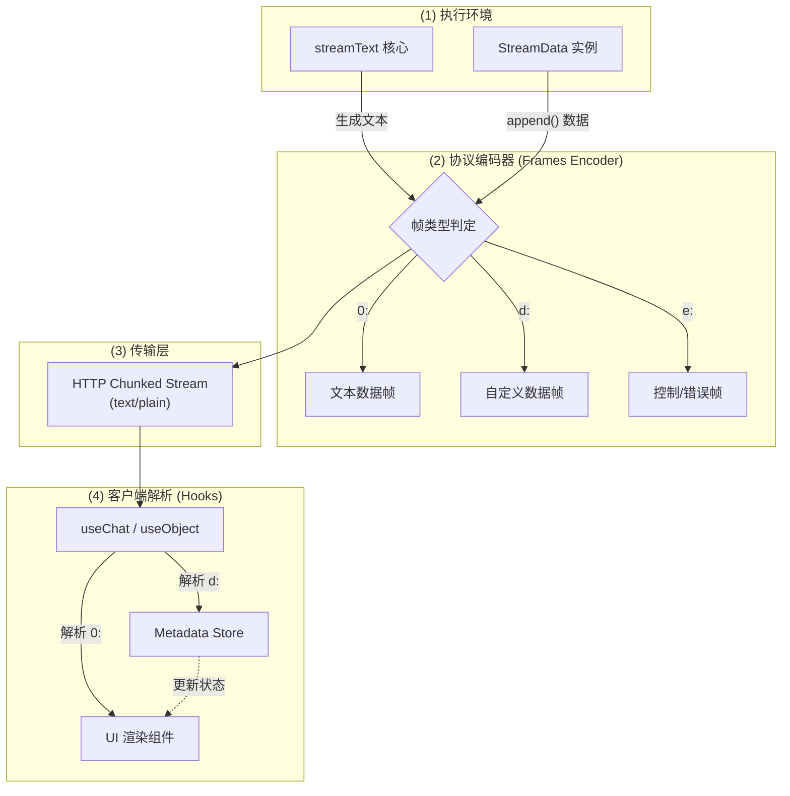
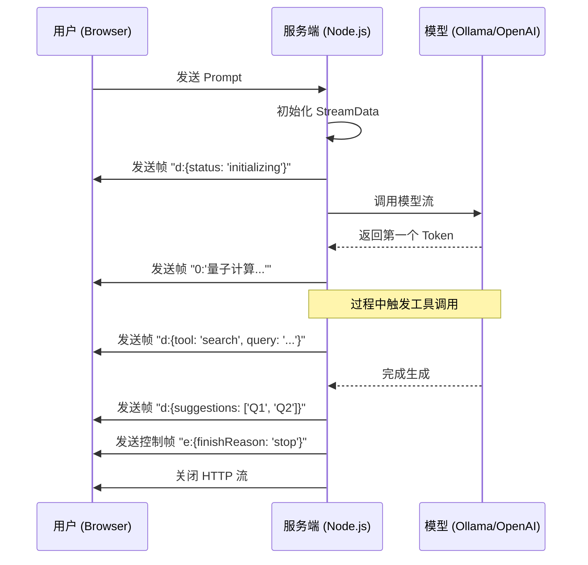

# 架构设计文档：增强型流式协议 (Data Stream Protocol)

本指南介绍了针对原文所做的**主要结构化优化**和**添加的图表类型**：
- **结构化重组**：将复杂的流式协议拆解为“服务端编码”与“客户端消费”两个核心视角。
- **添加图表**：引入了协议时序图 (Sequence Diagram) 和 帧结构示意图 (Graph)，直观展示多通道数据的同步逻辑。

## 1. 背景 (Background)
在构建生产级 AI 应用时，简单的文本流（SSE）已无法满足复杂的交互需求。开发者往往需要在发送 AI 回复的同时，同步传递引用来源、工具状态、建议问题等结构化元数据。Vercel AI SDK 的 **Data Stream Protocol** 旨在通过单 HTTP 连接实现这种多维数据的实时同步。

## 2. 核心价值：为什么它不仅是“流”？ (Core Value)

在传统的 LLM 开发中，流式传输通常只能发送纯文本。如果你想在 AI 回复的同时展示“来源链接”或“下一步建议”，通常会陷入以下窘境：
- **方案 A：发起两次请求**。先等 AI 说完，前端再发一个请求问“请给我来源”。这会导致用户感知的总延迟翻倍。
- **方案 B：在文本中硬编码 JSON**。让 AI 在流中返回 `[SOURCE:...]`。这不仅破坏了流的平滑显示，还极易导致前端解析出错（特别是流被切碎时）。

**Data Stream Protocol 通过“带标签的数据帧 (Labeled Frames)”彻底解决了这个问题：**

### 2.1 核心收益 (Key Benefits)

1.  **单连接同步 (Single-Stream Synchronization)**:
    - **原理**：在一个 HTTP 连接中并行传输多种数据类型。
    - **价值**：模型在吐字（文本帧 `0:`）的同时，后端可以异步注入业务数据（数据帧 `d:`）。无需二次往返，极大降低了复杂交互的延迟。

2.  **打破“黑盒生成” (Transparency & Feedback)**:
    - **原理**：利用数据帧实时推送中间状态。
    - **价值**：用户不再只是盯着跳动的光标，而是能看到“正在检索数据库...”、“正在分析引用来源...”等实时反馈。这种“所见即所得”的进度感能显著降低用户的跳出率。

3.  **协议级解耦 (Protocol-level Decoupling)**:
    - **原理**：将文本、元数据、工具调用、错误信息分别包装在不同的帧类型中（如 `0:`, `d:`, `t:`, `e:`）。
    - **价值**：前端 `useChat` 会自动识别这些标签。开发者不需要写复杂的正则表达式来提取文本中的数据，实现了“后端按需发，前端响应式收”的工程闭环。

4.  **智能状态管理 (Smart State Injection)**:
    - **原理**：支持在流的任意位置插入数据。
    - **价值**：
        - **流开始前**：推送上下文 ID 或初始 UI 配置。
        - **流过程中**：推送当前工具调用的中间结果。
        - **流结束后**：推送建议问题（Follow-up Questions）或成本统计（Token Usage）。

### 2.2 场景对比 (Scenario Comparison)

## 3. 系统设计 (Design)

### 3.1 协议架构图

### 3.2 交互时序图

## 4. 结论 (Conclusion)
Data Stream Protocol 不仅仅是一个传输协议，它是 AI 应用从“黑盒生成”向“透明交互”进化的基础设施。通过统一的帧格式，它极大地降低了前端处理复杂 AI 交互状态的难度。

### 🚀 最佳实践建议
- **尽早发送元数据**：在流开始前发送初始状态，减少用户的焦虑感。
- **精简帧体积**：虽然协议支持发送大量 JSON，但为了保证流的流畅性，应避免发送过大的二进制或超长文本元数据。
- **始终关闭容器**：在 `onFinish` 回调中调用 `data.close()`，防止前端连接挂起。

---

**🤖 协作说明**
> *本可视化文档基于架构师教授 `/prof` 的深度分析生成，并由 `vizdoc` 进行结构化与图表实现。*
