# 架构设计文档：增强型流式协议 (Data Stream Protocol)

本指南介绍了针对原文所做的**主要结构化优化**和**添加的图表类型**：
- **结构化重组**：将复杂的流式协议拆解为“服务端编码”与“客户端消费”两个核心视角。
- **添加图表**：引入了协议时序图 (Sequence Diagram) 和 帧结构示意图 (Graph)，直观展示多通道数据的同步逻辑。

## 1. 背景 (Background)
在构建生产级 AI 应用时，简单的文本流（SSE）已无法满足复杂的交互需求。开发者往往需要在发送 AI 回复的同时，同步传递引用来源、工具状态、建议问题等结构化元数据。Vercel AI SDK 的 **Data Stream Protocol** 旨在通过单 HTTP 连接实现这种多维数据的实时同步。

## 2. 核心价值：为什么它不仅是“流”？ (Core Value)

在传统的 LLM 开发中，流式传输通常只能发送纯文本。如果你想在 AI 回复的同时展示“来源链接”或“下一步建议”，通常会陷入以下窘境：
- **方案 A：发起两次请求**。先等 AI 说完，前端再发一个请求问“请给我来源”。这会导致用户感知的总延迟翻倍。
- **方案 B：在文本中硬编码 JSON**。让 AI 在流中返回 `[SOURCE:...]`。这不仅破坏了流的平滑显示，还极易导致前端解析出错（特别是流被切碎时）。

**Data Stream Protocol 通过“带标签的数据帧 (Labeled Frames)”彻底解决了这个问题：**

### 2.1 核心收益 (Key Benefits)

1.  **单连接同步 (Single-Stream Synchronization)**:
    - **原理**：在一个 HTTP 连接中并行传输多种数据类型。
    - **价值**：模型在吐字（文本帧 `0:`）的同时，后端可以异步注入业务数据（数据帧 `d:`）。无需二次往返，极大降低了复杂交互的延迟。

2.  **打破“黑盒生成” (Transparency & Feedback)**:
    - **原理**：利用数据帧实时推送中间状态。
    - **价值**：用户不再只是盯着跳动的光标，而是能看到“正在检索数据库...”、“正在分析引用来源...”等实时反馈。这种“所见即所得”的进度感能显著降低用户的跳出率。

3.  **协议级解耦 (Protocol-level Decoupling)**:
    - **原理**：将文本、元数据、工具调用、错误信息分别包装在不同的帧类型中（如 `0:`, `d:`, `t:`, `e:`）。
    - **价值**：前端 `useChat` 会自动识别这些标签。开发者不需要写复杂的正则表达式来提取文本中的数据，实现了“后端按需发，前端响应式收”的工程闭环。

4.  **智能状态管理 (Smart State Injection)**:
    - **原理**：支持在流的任意位置插入数据。
    - **价值**：
        - **流开始前**：推送上下文 ID 或初始 UI 配置。
        - **流过程中**：推送当前工具调用的中间结果。
        - **流结束后**：推送建议问题（Follow-up Questions）或成本统计（Token Usage）。

### 2.2 场景对比

## 3. 基础设施保障 (Infrastructure Continuity)
为了确保流式响应的连续性，除了协议层的设计，还需要在基础设施层引入可靠性编排。

关于如何利用 SDK 的 `experimental_fallback` 和 `experimental_loadBalance` 实现高可用路由，请参阅 [路由策略深度分析：原生 SDK 可靠性编排](./enterprise-routing/STRATEGIES_ANALYSIS.md#8-native-sdk-reliability-orchestration--原生-sdk-可靠性编排)。

## 4. 系统设计 (Design)

### 4.1 增强型流式协议架构设计

```mermaid
graph TD
    subgraph Server ["服务端 (Node.js/Next.js)"]
        A["streamText() 核心逻辑"]
        B["StreamData 容器"]
        C["Data Stream Protocol 编码器"]
        
        A -->|"0: 文本块"| C
        B -->|"d: 自定义元数据"| C
        A -.->|"e: 结束控制帧"| C
    end

    subgraph Transport ["传输层 (HTTP Stream)"]
        D["单 HTTP 连接<br/>(Content-Type: text/plain; charset=utf-8)"]
    end

    subgraph Client ["客户端 (Frontend)"]
        E["useChat / useObject Hooks"]
        F["UI 渲染层"]
        G["状态管理 (Metadata Store)"]
        
        E -->|"解析 0:"| F
        E -->|"解析 d:"| G
    end

    C --> D
    D --> E
    G -.->|"响应式更新"| F

    style B fill:#f9f,stroke:#333,stroke-width:2px
    style C fill:#0075ff,stroke:#fff,color:#fff
```

### 4.2 协议架构图 (逻辑视图)

```mermaid
graph TD
    subgraph App_Server ["(1) 执行环境"]
        A["streamText 核心"]
        B["StreamData 实例"]
    end

    subgraph Encoder ["(2) 协议编码器 (Frames Encoder)"]
        C{"帧类型判定"}
        C -->|"0:"| D["文本数据帧"]
        C -->|"d:"| E["自定义数据帧"]
        C -->|"e:"| F["控制/错误帧"]
    end

    subgraph Transport ["(3) 传输层"]
        G["HTTP Chunked Stream<br/>(text/plain)"]
    end

    subgraph Client ["(4) 客户端解析 (Hooks)"]
        H["useChat / useObject"]
        I["UI 渲染组件"]
        J["Metadata Store"]
    end

    A -->|"生成文本"| C
    B -->|"append() 数据"| C
    C --> G
    G --> H
    H -->|"解析 0:"| I
    H -->|"解析 d:"| J
    J -.->|"更新状态"| I
```

### 4.3 交互时序图

```mermaid
sequenceDiagram
    participant User as 用户 (Browser)
    participant Server as 服务端 (Node.js)
    participant LLM as 模型 (Ollama/OpenAI)

    User->>Server: 发送 Prompt
    Server->>Server: 初始化 StreamData
    Server->>User: 发送帧 "d:{status: 'initializing'}"
    
    Server->>LLM: 调用模型流
    LLM-->>Server: 返回第一个 Token
    Server->>User: 发送帧 "0:'量子计算...'"
    
    Note over Server, LLM: 过程中触发工具调用
    Server->>User: 发送帧 "d:{tool: 'search', query: '...'}"
    
    LLM-->>Server: 完成生成
    Server->>User: 发送帧 "d:{suggestions: ['Q1', 'Q2']}"
    Server->>User: 发送控制帧 "e:{finishReason: 'stop'}"
    
    Server->>User: 关闭 HTTP 流
```

## 5. 结论 (Conclusion)
Data Stream Protocol 不仅仅是一个传输协议，它是 AI 应用从“黑盒生成”向“透明交互”进化的基础设施。通过统一的帧格式，它极大地降低了前端处理复杂 AI 交互状态的难度。

### 🚀 最佳实践建议
- **尽早发送元数据**：在流开始前发送初始状态，减少用户的焦虑感。
- **精简帧体积**：虽然协议支持发送大量 JSON，但为了保证流的流畅性，应避免发送过大的二进制或超长文本元数据。
- **始终关闭容器**：在 `onFinish` 回调中调用 `data.close()`，防止前端连接挂起。

---

**🤖 协作说明**
> *本可视化文档基于架构师教授 `/prof` 的深度分析生成，并由 `vizdoc` 进行结构化与图表实现。*
