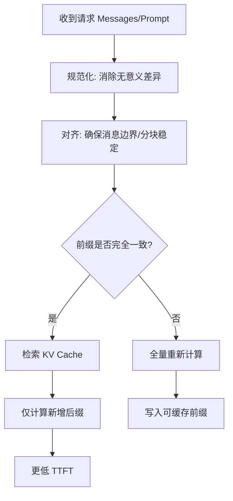
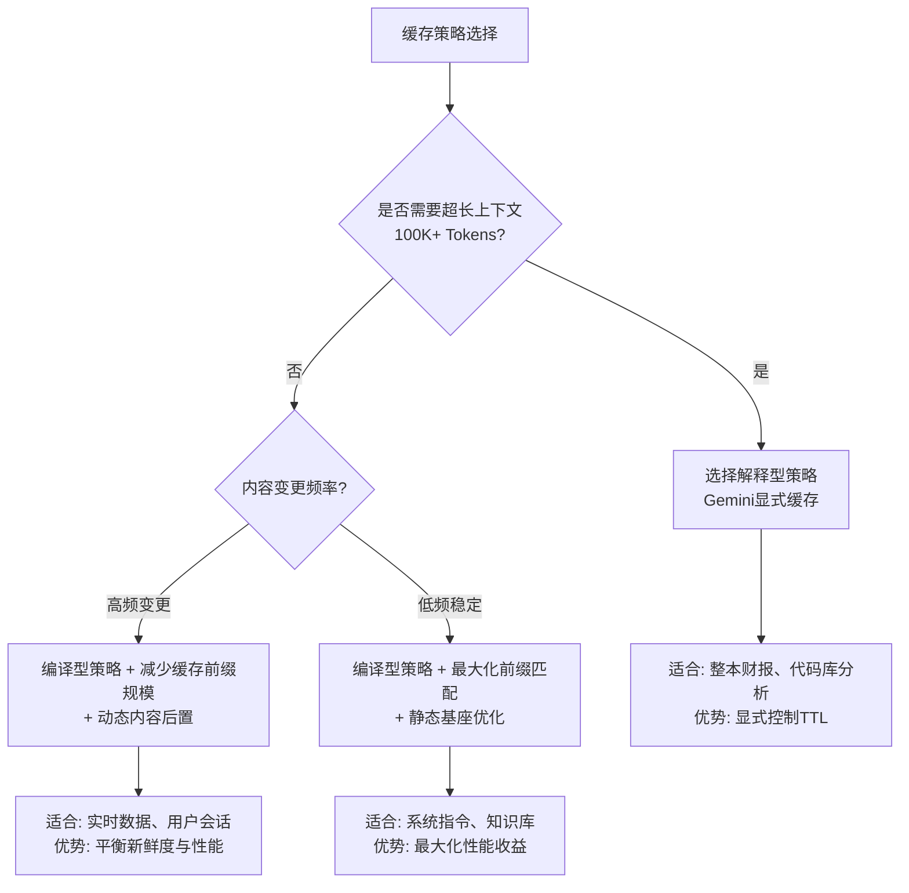
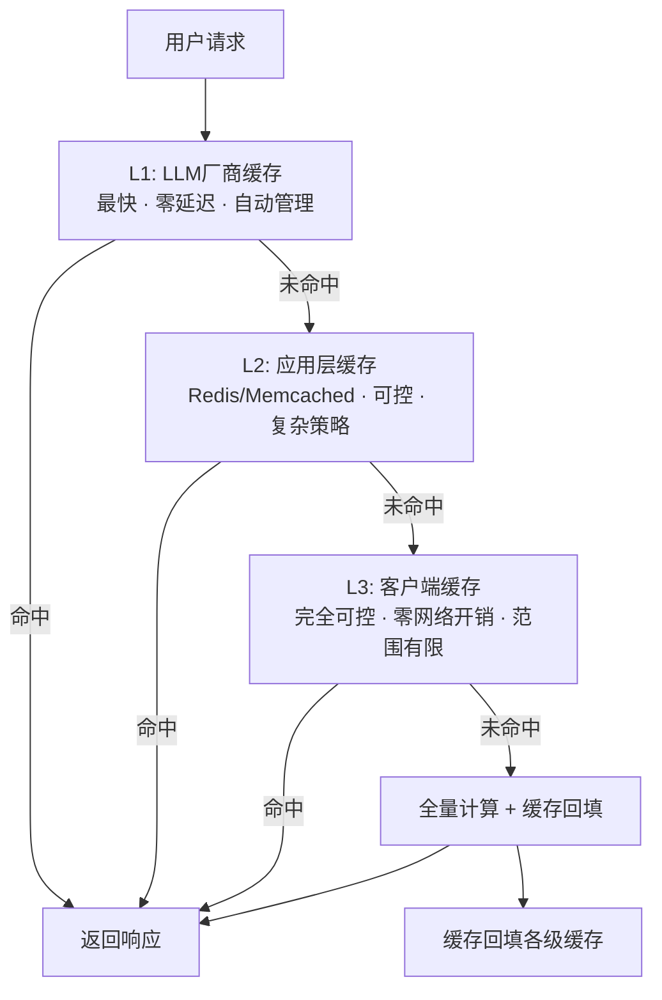

# 🧠 专题文档：Prompt Caching (提示词缓存) 技术深度解析

你好！我是你的设计模式教练。今天我们将深入探讨 AI 系统性能优化中的关键能力——**Prompt Caching**。

在传统软件工程中，我们通过 Redis/CDN 复用“计算结果”；在大模型推理中，Prompt Caching 复用的是“已处理前缀的中间状态（KV Cache）”。当你的请求具有高度重复的前缀时，它可以显著降低首字延迟（TTFT）并降低输入侧成本。

---

## 1. 核心原理：前缀匹配与分块机制

Prompt Caching 的本质是**计算重用**。当模型处理一段文字时，它会将中间状态（KV Cache）序列化并存储在近端存储中。

需要特别强调：缓存命中通常发生在**Token 级别**，而不是“肉眼看起来一样”的字符串级别。任何会改变分词结果的差异（空格、换行、标点、模板渲染的小变动、消息边界变化）都可能导致命中失败。

### 🧩 分块匹配逻辑
大多数供应商（如 DeepSeek, Anthropic）遵循以下逻辑：
1. **前缀匹配**：只有从 Prompt **开头**开始完全一致的部分才能被缓存命中。
2. **分块单位**：
   - **DeepSeek**: 以 64 Tokens 为一个区块（Block）。
   - **Anthropic**: 内部有特定的对齐机制。
3. **顺序敏感**：即使内容完全一样，只要位置发生了偏移（比如前面多了一个空格），缓存就会失效。

### 📊 缓存匹配流程 (Mermaid)


---

## 2. 核心设计模式：适配缓存的 Prompt 结构

为了最大化缓存命中率，我们需要改变传统的 Prompt 构建习惯。

### 🏗️ 模式一：静态优先模式 (Static-First Pattern)
**坏味道**：将动态变量（如日期、用户 ID）放在 Prompt 开头。
**优化方案**：将稳定的、巨大的内容（系统指令、长知识库、Few-shot 示例）置于顶部。

```javascript
// ❌ 错误做法：动态内容在前，导致后续全量失效
const prompt = `当前时间: ${Date.now()}\n\n核心知识库: ${HUGE_DOCS}\n\n问题: ${userQuery}`;

// ✅ 正确做法：静态内容在前
const messages = [
  { role: 'system', content: '你是一个专业的文档分析专家。' },
  { role: 'user', content: `这是公司的核心知识库：\n${HUGE_DOCS}` },
  { role: 'user', content: `当前时间: ${Date.now()}\n问题: ${userQuery}` }
];
```

### 🔄 模式二：上下文归一化 (Context Normalization)
**核心思想**：消除无关的细微差异。
- **强制截断**：确保历史对话的消息数量或 Token 长度按固定规则稳定（固定轮数、固定 Token 上限、按供应商对齐策略做分块对齐）。
- **结构对齐**：使用统一的 JSON Schema 或 Markdown 格式，避免多余的换行符波动。

### 🧱 模式三：前缀锚定与滚动窗口 (Anchored Prefix + Sliding Window)
多轮对话场景里，缓存最容易被你“自己破坏”。典型坏味道是：每轮都从最前面删一条历史消息（为了控长度）。这会让后续所有消息整体左移，导致从开头开始的前缀不再一致。

更稳的做法是把对话拆成两段：
1. **锚定前缀（尽量不变）**：系统指令、工具定义、固定 few-shot、长期记忆快照（可选）。
2. **滚动后缀（允许变化）**：最近 N 轮对话 + 当前问题。

一个可操作的截断策略：
- 保持“锚定前缀”永远在最前面且内容稳定
- 超长时优先裁剪“滚动后缀”中最旧的部分
- 如果必须保留早期语义，用“摘要快照”替代早期对话，并把摘要放进锚定前缀（摘要本身保持稳定，更新频率要低）

### 🧾 模式四：确定性序列化 (Deterministic Serialization)
很多“看起来没变”的 Prompt，其实变在了序列化细节上，导致缓存命中率随机波动。

常见不稳定来源：
- JSON 对象 key 顺序不固定
- 浮点数/时间格式化存在差异（`1` vs `1.0`，时区/locale 变化）
- 换行符差异（LF/CRLF）、尾随空格、Unicode 归一化差异
- 工具列表、示例列表、检索片段列表的排序不稳定

可操作的约束：
- 所有结构化内容都走同一套序列化（固定 key 顺序、固定数字/时间格式）
- 所有列表在拼接前做确定性排序（例如按 `id`、`rank`、`document_id/chunk_id`）
- 文本拼接统一换行符与裁剪规则（例如统一为 `\n`，统一去掉行尾空白）

### 🧩 模式五：缓存边界契约 (Cache Boundary Contract)
把“哪些内容允许进前缀缓存、哪些必须留在后缀”写成一份契约，会显著降低未来改动对命中率的破坏。

一个最小契约可以是：
- 前缀：系统指令、工具定义、输出格式约束、固定 few-shot、固定知识基座
- 后缀：用户输入、时间戳/追踪 ID、权限/租户相关信息、检索结果（除非你做了稳定基座）

---

## 3. 供应商差异化实践

不同供应商的缓存策略与计费经常演进，下表更适合作为“对比维度清单”，而不是永久准确的规格说明。落地前请以各家官方文档为准。

| 特性 | DeepSeek | Anthropic (Claude) | Azure OpenAI (GPT) | Google Gemini |
| :--- | :--- | :--- | :--- | :--- |
| **触发方式** | **自动触发** | **手动标记** (`cache_control`) | **自动触发** | **显式创建** (Context Caching API) |
| **匹配精度** | 64 Tokens 区块对齐 | 较为严格的前缀对齐 | 常见为按步长对齐 | 灵活，需指定 TTL |
| **计费逻辑** | 命中部分约 1/10 价格 | 缓存写入费 + 读取费 | 缓存命中折扣 (约 50%) | 按存储容量/时长计费 |
| **适用场景** | 长对话、RAG | 系统指令、工具定义 | 高频重复 Prompt | 超大规模上下文 (1M+) |

### 🚀 供应商深度细节

#### 1. Azure OpenAI (OpenAI)
- **门槛**：通常需要足够长的重复前缀才能体现收益。
- **自动管理**：无需开发者干预，系统会自动识别最近使用的长 Prompt 前缀。
- **最佳实践**：把最稳定、最长的部分放在最前面，并尽量减少消息边界与格式抖动。

#### 2. Google Gemini (Context Caching)
- **核心差异**：Gemini 的缓存是**显式**的。你需要先通过 API 创建一个 `CachedContent`，获得一个 ID，然后在请求中引用这个 ID。
- **生命周期**：支持设置 TTL（生存时间），适合处理那些在几小时内会被频繁访问的超大文档（如整本财报、整库代码）。
- **优势**：支持高达 **1M+ Tokens** 的超大规模上下文缓存，非常适合“长上下文 Agent”。

---

## 4. 真实场景推演：RAG 系统中的应用

假设你有一个包含 10 万字的法律法规 RAG 系统。

1. **朴素做法**：每次搜索到相关片段后，拼接成 Prompt 发送。
   - *结果*：每次片段顺序不同，缓存几乎不命中，延迟 5-8s。
2. **缓存优化做法**：
   - 将最核心、最常被引用的 50 篇法规构建成一个“固定的上下文基座”。
   - 将这部分作为 `System Message` 或第一条 `User Message` 锁定。
   - 对检索片段做“确定性排序”（例如按 `document_id, chunk_id` 排序），避免同样内容因顺序波动导致前缀失配。
   - *结果*：基座部分 100% 命中缓存，延迟降至 < 1s。

---

## 5. 生产化清单：别让缓存变成隐患

把 Prompt Caching 做成“可持续的工程能力”，通常需要同时覆盖性能、正确性与安全性：

1. **版本化（防止错缓存）**
   - 为 System Prompt、工具定义、输出格式等增加显式版本号（例如 `prompt_schema_version`）。
   - 当你升级指令或输出 Schema 时，版本号变化会自然“切断”旧缓存，避免新逻辑命中旧前缀导致行为漂移。

2. **多租户隔离（防止串缓存）**
   - 在你自建缓存（例如本地 KV/Redis）时，缓存键必须包含 `tenant_id / app_id / model_id` 等隔离维度。

3. **可观测性（知道有没有真的命中）**
   - 记录并观察：命中率、命中前缀 token 数、TTFT、端到端延迟、输入 token 成本。
   - 对“命中但没变快”的情况做分解：网络 RTT、排队、输出长度、工具调用等待等。

4. **归一化边界（别把语义归一化没了）**
   - 只归一化“无意义差异”（多余空格/换行、模板渲染产生的尾随空白等）。
   - 不要做会改变含义的改写（例如自动改标点、自动纠错、自动重排段落）。

5. **隐私与合规（缓存里可能有敏感信息）**
   - 避免把用户 PII 放进可被长期缓存的前缀。
   - 必要时采用脱敏/哈希占位，把真实值放到后缀里。

6. **基准与回归（别靠感觉）**
   - 固定同一批请求做 A/B：冷启动 vs 热命中，观察 TTFT、端到端延迟与输入 token 成本。
   - 任何 prompt 结构调整都要跑回归，避免“命中率下降但没人发现”。

7. **灰度与熔断（命中异常要能快速止血）**
   - 当命中率、TTFT 或成本指标异常时，支持快速切换策略（例如关闭某些归一化、降低缓存前缀规模、回退到无缓存构造）。
   - 把策略切换做成可配置项，而不是代码热修。

---

## 6. 教练的挑战：苏格拉底式思考

> **提问**：如果你正在开发一个**多轮对话**的 Agent，用户每轮都会输入新的问题。为了保持最高缓存命中率，你应该如何处理历史对话的“滚动截断”？
>
> **提示**：想想“前缀匹配”的原则。如果你每轮都删掉第一条对话，会发生什么？

---

## 7. 架构模式分类：编译型 vs 解释型缓存策略

从架构设计角度，Prompt Caching 策略可以分为两大模式，对应不同的系统架构哲学：

### 🏗️ 编译型缓存策略 (Compiled Caching)
**本质特征**: 确定性、静态优先、前缀匹配驱动
- **适用场景**: 系统指令、工具定义、固定知识库、输出格式约束
- **技术实现**: 前缀精确匹配、确定性序列化、版本化基座
- **代表供应商**: DeepSeek, Azure OpenAI 的自动缓存机制
- **架构哲学**: "Write-time" 优化 - 在构造时确保缓存友好性

### 🔄 解释型缓存策略 (Interpreted Caching)  
**本质特征**: 动态管理、显式控制、生命周期驱动
- **适用场景**: 超大上下文、频繁变更内容、多租户隔离、临时性资源
- **技术实现**: 显式缓存ID、TTL管理、版本控制、动态注入
- **代表供应商**: Gemini Context Caching, Anthropic cache_control
- **架构哲学**: "Runtime" 优化 - 在运行时动态管理缓存策略

### 📊 架构选择决策树



### 🎯 模式选择指南

1. **编译型优先原则**: 大多数场景应优先使用编译型策略，因其更简单可靠
2. **混合架构模式**: 复杂系统可以同时使用两种模式，不同模块采用不同策略
3. **演进路径**: 从编译型开始，随着业务复杂度增加逐步引入解释型能力

---

## 8. 多级缓存架构设计

真实世界的生产系统需要构建**多级缓存架构**，而不仅仅是依赖LLM厂商的单级缓存。多级缓存提供了更好的可控性、弹性和性能优化空间。

### 🎯 三级缓存体系



#### 🚀 L1缓存 - LLM厂商原生缓存
- **优势**: 零额外延迟、自动管理、无需维护
- **局限**: 不可控、供应商锁定、策略不透明
- **最佳实践**: 最大化利用，作为性能基准

#### ⚡ L2缓存 - 应用层缓存 (Redis/Memcached)
- **优势**: 完全可控、支持复杂策略、跨请求复用
- **典型用例**:
  - 缓存预处理结果（归一化后的Prompt）
  - 缓存常见查询的完整响应
  - 实现租户级隔离和配额管理
- **技术选择**: Redis（复杂策略）、Memcached（纯缓存）

#### 💾 L3缓存 - 客户端/边缘缓存
- **优势**: 零网络开销、完全隔离、极致性能
- **典型用例**:
  - 静态资源缓存（UI组件、模板）
  - 用户会话缓存
  - 离线能力支持

### 🛡️ 缓存穿透保护策略

#### 1. Bloom Filter 防雪崩
```javascript
// 使用Bloom Filter防止缓存击穿
class CacheProtection {
  constructor() {
    this.bloomFilter = new BloomFilter();
    this.penaltyBox = new Map(); // 短时封禁频繁缺失的键
  }
  
  shouldProcess(key) {
    if (this.penaltyBox.has(key)) return false;
    if (!this.bloomFilter.mightContain(key)) {
      this.penaltyBox.set(key, Date.now() + 5000); // 5秒冷却
      return false;
    }
    return true;
  }
}
```

#### 2. 降级与熔断机制
- **降级策略**: 缓存失效时优雅降级到无缓存模式
- **熔断机制**: 命中率异常时自动切换缓存策略
- **健康检查**: 定期验证缓存层健康状态

#### 3. 请求合并与去重
- 对相同请求进行合并，避免重复计算
- 实现请求级锁机制，防止缓存风暴

### 🔄 缓存回填与更新策略

1. **Write-through策略**: 计算完成后同步更新所有缓存层
2. **Write-behind策略**: 异步更新缓存，优先响应性能
3. **版本化更新**: 基于版本号进行缓存失效和更新
4. **增量更新**: 只更新变化的部分，减少网络开销

### 📊 多级缓存监控指标

| 层级 | 关键指标 | 告警阈值 |
|------|----------|----------|
| L1   | 厂商缓存命中率、TTFT降低比例 | 命中率 < 60% |
| L2   | Redis命中率、内存使用率、网络延迟 | P99延迟 > 50ms |
| L3   | 客户端缓存命中率、存储使用量 | 命中率异常波动 |
| 整体 | 端到端命中率、成本节省比例 | 整体命中率 < 70% |

---

## 9. 扩展阅读与参考
- 示例代码：[26-performance-cost-optimization.js](./26-performance-cost-optimization.js)
- 供应商文档：[DeepSeek Prompt Caching Guide](https://api-docs.deepseek.com/guides/prompt_caching)
