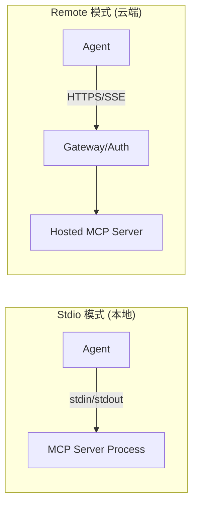

# MCP 传输协议深度分析报告：Stdio vs. Remote

本报告针对 Model Context Protocol (MCP) 的两种核心传输模式——**Stdio (标准输入输出)** 与 **Remote (远程/托管)** 进行深度对比分析，旨在指导开发者在不同业务场景下做出最优架构选型。

---

## 1. 架构设计对比 (Architecture Overview)

| 维度 | **Stdio (本地子进程)** | **Remote (远程托管服务)** |
| :--- | :--- | :--- |
| **运行实体** | Agent 启动的本地子进程 (Subprocess) | 独立运行的远程服务器 (Remote Server) |
| **通信协议** | JSON-RPC over Standard Streams (stdin/stdout) | JSON-RPC over HTTP/SSE 或 WebSocket |
| **连接标识** | 可执行命令 (如 `npx`, `python`, `docker`) | 专属连接地址 (**Remote URL**) |
| **生命周期** | 耦合。Agent 销毁则进程结束。 | 解耦。服务持续运行，Agent 仅作为客户端连接。 |

### 架构图示

---

## 2. 环境变量与配置管理 (Configuration & Environment)

### **Stdio：进程继承模式**
在 Stdio 模式下，环境变量是“**注入式**”的。
- **获取逻辑**：MCP 服务器作为一个子进程，继承父进程（Agent）的 `os.environ`。
- **配置示例**：
  在 [5-mcp-weread.py](./5-mcp-weread.py) 中，通过 `env_keys` 显式指定需要透传的变量（如 `WEREAD_COOKIE`）。
- **风险点**：本地 `.env` 文件可能包含敏感信息，若不慎将整个环境变量导出给不受信任的工具，存在泄漏风险。

### **Remote：身份鉴权模式**
在 Remote 模式下，环境变量是“**凭证式**”的。
- **获取逻辑**：服务器端已配置好运行环境，Agent 端只需提供访问该服务的权限信息。
- **核心字段**：
    - **AP_APP_ID**: 应用唯一标识符。
    - **AP_APP_KEY**: 应用访问密钥（敏感信息）。
- **敏感性保护**：Remote URL 是为您分配的专属连接地址，为敏感信息，请勿对外泄漏！一旦泄漏，等同于将您的工具集访问权交予他人。

---

## 3. 安全与鉴权体系 (Security & Authentication)

| 鉴权特性 | **Stdio** | **Remote** |
| :--- | :--- | :--- |
| **鉴权类型** | **无鉴权 / 隐式鉴权**。基于本地文件系统的访问权限。 | **显式鉴权**。通常包含 `AppID` + `AppKey`。 |
| **敏感信息存储** | 本地环境变量、`.env` 文件。 | 托管服务端的密钥管理系统 (KMS)。 |
| **传输安全** | 不涉及网络传输（内存/管道通信）。 | 强制使用 HTTPS 加密传输。 |
| **有效期** | 随进程生命周期结束。 | 具备有效期管理，可动态吊销 Key。 |

---

## 4. 选型决策矩阵 (Decision Matrix)

作为**设计模式教练**，我建议根据以下维度进行选型：

### **场景 A：选择 Stdio 的理由**
1. **本地资源访问**：需要读取本地文件系统、执行本地 Shell 脚本、连接本地局域网数据库。
2. **极低延迟**：不希望受到网络波动影响，追求亚毫秒级的工具调用。
3. **私密性极高**：处理的数据绝不能离开本地环境。
4. **开发阶段**：快速迭代本地 MCP Server 逻辑。

### **场景 B：选择 Remote 的理由**
1. **计算密集型工具**：如大型文档解析、高频网页爬取、复杂图像处理，不希望占用本地 Agent 的 CPU。
2. **多 Agent 共享**：多个团队的 Agent 需要复用同一个专业工具集（如统一的企业内部知识库检索）。
3. **SaaS 服务集成**：使用第三方提供的标准化 MCP 能力（如 Hosted MCP 服务）。
4. **分布式部署**：Agent 运行在容器中，无法安装复杂的本地依赖环境（如 Playwright 依赖的浏览器环境）。

---

## 5. 生产级演进建议 (Production-Ready Recommendations)

为了将 MCP 集成从“实验级”提升至“生产级”，建议关注以下设计模式与实践：

### **A. 健壮性设计 (Resilience)**
- **超时与重试**：Remote 模式受网络波动影响大。应在初始化时配置 `max_retries` 和细化的 `timeout`（区分连接超时与读取超时）。
- **降级策略**：当 Remote MCP 不可用时，设计 Agent 的兜底逻辑（如改用模型内置知识或提示用户稍后再试）。

### **B. 架构解耦 (Decoupling)**
- **依赖注入 (DI)**：利用 Pydantic AI 的 `deps` 机制将 MCP Server 注入 Agent。这使得在单元测试中可以通过 Mock Server 替代真实的远程连接。
- **工具前缀 (Prefixing)**：连接多个 MCP Server 时，使用 `tool_prefix`（如 `amap_`）防止工具命名冲突。

### **C. 可观测性 (Observability)**
- **结构化日志**：集成 [logfire](https://logfire.pydantic.dev/) 追踪每一次工具调用的入参、出参及耗时。
- **度量监控**：监控 Remote MCP 的响应时间（P99）和错误率，及时发现托管服务的性能瓶颈。

### **D. 安全进阶 (Security)**
- **Token 动态刷新**：对于有有效期的 Token（如 ModelScope），实现自动刷新机制而非静态存储在 `.env` 中。
- **权限最小化**：仅为 Agent 分配其任务必需的 MCP 工具访问权限。

---

## 6. 教练总结

**Stdio 是“单兵作战”的利器，Remote 是“协同作战”的基石。**

- 当你追求**简单、可控、私密**时，请使用 **Stdio**。
- 当你追求**弹性、共享、专业托管**时，请使用 **Remote**。

> **警告**：在使用 Remote 模式时，请务必妥善保管你的 `AP_APP_KEY`。在代码实现中，应始终通过环境变量（如 `process.env.AP_APP_KEY`）读取，严禁硬编码在源码中。
